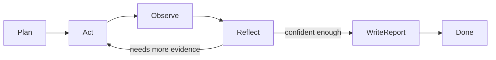

# research-agent

Autonomous technical research agent powered by [LangGraph](https://github.com/langchain-ai/langgraph) and [Ollama](https://ollama.com). All LLM inference runs **locally** — no cloud APIs, no API keys, zero paid services.

Given a research question, the agent follows a **Plan → Act → Observe → Reflect** loop to iteratively gather evidence from the web and local documents, then produces a polished Markdown report with citations and a Mermaid architecture diagram.

## Architecture

```
research_agent/
├── api/          # FastAPI app + routers
├── cli/          # Typer CLI
├── graph/        # LangGraph state machine (plan/act/observe/reflect/write)
├── llm/          # Ollama HTTP client + LLM adapter
├── tools/        # Web search, URL fetch, Python sandbox, local docs, RAG stub
├── memory/       # SQLite persistence for runs
├── report/       # Markdown + Mermaid report rendering
└── util/         # Logging helpers
```

### Agent Loop



## Quickstart

### Prerequisites

- [Docker](https://docs.docker.com/get-docker/) and Docker Compose
- ~4 GB free disk space for the Gemma model

### 1. Start services

```bash
cp .env.example .env
docker compose up -d
```

### 2. Pull the default model

```bash
make pull-model
```

This runs `ollama pull gemma` inside the Ollama container. First pull downloads ~5 GB. The model is persisted in a named Docker volume so it survives restarts.

### 3. Run a research query

**CLI:**

```bash
docker compose run --rm api python -m research_agent.cli.main \
  "What are the best practices for deploying LLMs in production?"
```

**API:**

```bash
curl -X POST http://localhost:8000/api/research \
  -H "Content-Type: application/json" \
  -d '{"question": "What are the best practices for deploying LLMs in production?"}'
```

**Web UI:**

Open [http://localhost:8000](http://localhost:8000) in your browser.

## Configuration

All configuration is via environment variables (or `.env` file):

| Variable | Default | Description |
|---|---|---|
| `OLLAMA_HOST` | `http://ollama:11434` | Ollama API endpoint |
| `OLLAMA_MODEL` | `gemma` | Model to use for inference |
| `OLLAMA_TIMEOUT_SECONDS` | `120` | Timeout per LLM call |
| `LOG_LEVEL` | `INFO` | Logging verbosity |

### Using a different model

```bash
# In .env
OLLAMA_MODEL=llama3

# Pull it
docker compose exec ollama ollama pull llama3
```

## CLI Options

```
research-agent research [OPTIONS] QUESTION

Options:
  --audience TEXT       Target audience: engineer or executive  [default: engineer]
  --depth TEXT          Desired depth of research               [default: thorough]
  --max-iters INTEGER  Maximum research iterations              [default: 6]
  --timebox INTEGER    Timebox in minutes                       [default: 5]
  --raw                Print raw markdown instead of rendered
```

## API Endpoints

| Method | Path | Description |
|---|---|---|
| `POST` | `/api/research` | Start a research run |
| `GET` | `/api/runs` | List previous runs |
| `GET` | `/api/runs/{run_id}` | Get a specific run result |
| `GET` | `/health` | Health check |
| `GET` | `/` | Web UI |

### POST /api/research

```json
{
  "question": "Your research question",
  "audience": "engineer",
  "desired_depth": "thorough",
  "max_iters": 6,
  "timebox_minutes": 5
}
```

## Tools

The agent has access to these tools during research:

| Tool | Description |
|---|---|
| `web_search` | DuckDuckGo search (no API key needed) |
| `fetch_url` | Fetch and extract content from URLs |
| `python_sandbox` | Execute Python in a sandboxed subprocess |
| `local_docs` | Search `./docs` and `./data` directories |
| `elastic_rag` | Elasticsearch RAG stub (implement to integrate) |

### Adding a custom tool

1. Create a class in `research_agent/tools/` extending `BaseTool`
2. Implement the `async run(self, *, query: str, **kwargs) -> ToolResult` method
3. Register it in `research_agent/tools/__init__.py` `TOOL_REGISTRY`

## Report Output

Every report contains:

1. **Summary** — concise overview
2. **Key Findings** — bullet list with evidence references
3. **Recommendations** — actionable items with tradeoffs
4. **Architecture Diagram** — Mermaid diagram
5. **Sources** — numbered citations with URLs

See [docs/sample-output.md](docs/sample-output.md) for a full example.

## Development

### Run tests

```bash
make test
```

### Lint / format

```bash
make lint
make fmt
```

### Make targets

| Target | Description |
|---|---|
| `make up` | Build and start all services |
| `make down` | Stop all services |
| `make logs` | Tail service logs |
| `make pull-model` | Pull the default Ollama model |
| `make test` | Run pytest |
| `make lint` | Run ruff linter |
| `make fmt` | Run ruff formatter |
| `make run-example` | Run an example research query |

## License

MIT
