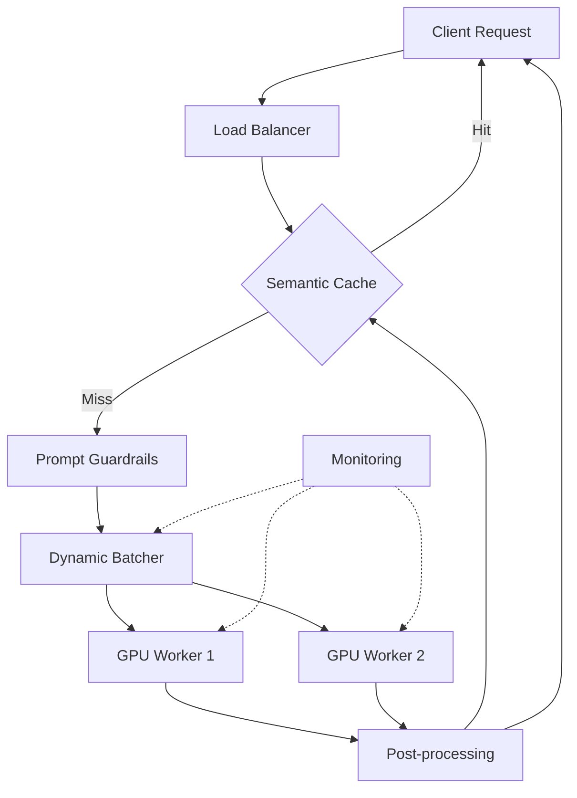

# Sample Output

Below is an example of the kind of report the research agent produces.

---

## Summary

Deploying large language models (LLMs) in production requires careful consideration of infrastructure, latency, cost, and reliability. Containerized deployments with GPU scheduling, model quantization, and caching layers form the foundation of most production architectures.

## Key Findings

- **Containerization is standard**: Docker/Kubernetes with GPU operator plugins is the dominant deployment pattern [1]
- **Quantization reduces cost**: 4-bit and 8-bit quantization (GPTQ, AWQ) can cut memory requirements by 50–75% with minimal quality loss [2]
- **Batching matters**: Dynamic batching (e.g., vLLM, TGI) increases throughput 3–5x over naive sequential inference [3]
- **Caching is critical**: Semantic caching of common queries can reduce LLM calls by 20–40% [4]
- **Monitoring is non-negotiable**: Track latency (p50/p95/p99), token throughput, error rates, and model drift [5]

## Recommendations

| Recommendation | Tradeoff |
|---|---|
| Use vLLM or TGI for serving | Higher setup complexity vs. raw inference |
| Apply 4-bit quantization | ~2% quality degradation for 4x memory savings |
| Implement semantic caching | Cache invalidation complexity |
| Deploy on Kubernetes with GPU operator | Operational overhead of K8s |
| Set up prompt guardrails | Additional latency per request |

## Architecture Diagram

## Sources

1. [Kubernetes GPU Scheduling Guide](https://kubernetes.io/docs/tasks/manage-gpus/scheduling-gpus/)
2. [GPTQ: Accurate Post-Training Quantization](https://arxiv.org/abs/2210.17323)
3. [vLLM: Easy, Fast, and Cheap LLM Serving](https://vllm.ai)
4. [GPTCache: Semantic Caching for LLMs](https://github.com/zilliztech/GPTCache)
5. [ML Monitoring Best Practices](https://neptune.ai/blog/ml-model-monitoring-best-practices)
